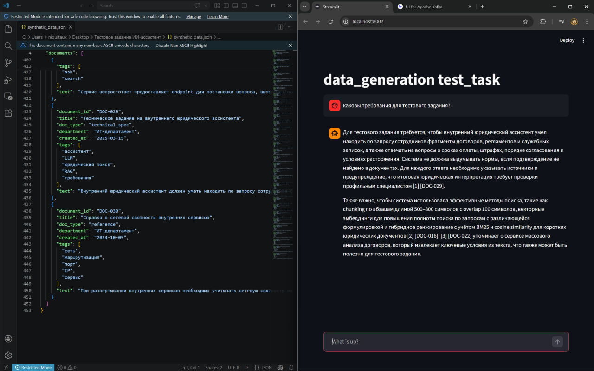

- поднимается проект через `docker compose up --build` 
- фронтенд тут [http://localhost:8002/](http://localhost:8002/)
- также есть интерфейс для кафки [http://localhost:8080/](http://localhost:8080/)
- тасктреккер находится в `task_tracker.txt`, по комитам виден процесс выполения тасок

